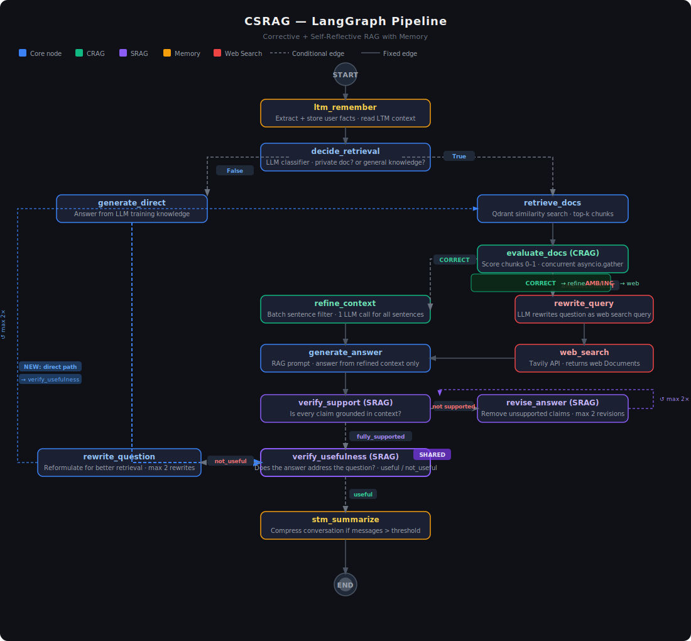

# CSRAG — Corrective + Self-Reflective RAG with Short & Long Term Memory

A production-grade conversational RAG API combining four advanced patterns into a single unified LangGraph pipeline, deployed on AWS EC2 with full CI/CD.

---

## Graph Architecture



---

## What's inside

| Pattern | What it does |
|---|---|
| **CRAG** | Scores every retrieved chunk (0–1). CORRECT → use internal docs. AMBIGUOUS/INCORRECT → rewrite query + Tavily web search. |
| **SRAG** | Verifies factual grounding (`fully_supported` / `partially_supported` / `no_support`) and usefulness of every answer. Revises if needed. |
| **STM** | Rolling conversation summarisation via LangGraph `AsyncPostgresSaver`. Summarises when message count exceeds threshold; keeps only last 2 messages + summary. |
| **LTM** | Persistent per-user fact store via LangGraph `AsyncPostgresStore`. Extracts atomic facts from every user message; injects them into every system prompt. |

---

## Stack

| Layer | Technology |
|---|---|
| LLM | Groq `llama-3.3-70b-versatile` |
| Embeddings | Ollama `nomic-embed-text` (local, 768-dim) |
| Vector DB | Qdrant Cloud |
| Memory DB | PostgreSQL (`AsyncPostgresStore` + `AsyncPostgresSaver`) |
| Web Search | Tavily |
| Framework | LangGraph + FastAPI |
| Config | pydantic-settings |
| Registry | Docker Hub |
| Hosting | AWS EC2 (t3.small + 4GB swap) |

---

## Project structure

```
CSRAG/
├── app/
│   ├── __init__.py                # __version__
│   ├── main.py                    # FastAPI app, async lifespan, router registration
│   ├── config.py                  # All settings via pydantic-settings
│   │
│   ├── api/
│   │   ├── schemas.py             # All Pydantic request/response models
│   │   └── routes/
│   │       ├── health.py          # GET /health, GET /health/ready
│   │       ├── documents.py       # POST /documents/upload, GET /documents/info, DELETE /documents/collection
│   │       ├── chat.py            # POST /chat, POST /chat/stream, GET /chat/history/{thread_id}
│   │       └── memory.py          # GET /memory/{user_id}, DELETE /memory/{user_id}
│   │
│   ├── core/
│   │   ├── embeddings.py          # OllamaEmbeddings (nomic-embed-text) — cached
│   │   ├── vector_store.py        # VectorStoreService (Qdrant Cloud)
│   │   ├── document_processor.py  # PDF/TXT/CSV loading + chunking
│   │   ├── csrag_engine.py        # Main orchestration service (wraps the graph)
│   │   │
│   │   ├── graph/
│   │   │   ├── state.py           # CSRAGState TypedDict
│   │   │   ├── nodes.py           # All 14 node functions + routing functions
│   │   │   └── builder.py         # StateGraph wiring + compile()
│   │   │
│   │   ├── crag/
│   │   │   ├── evaluator.py       # CRAGEvaluator — chunk scoring + CORRECT/AMBIGUOUS/INCORRECT
│   │   │   └── web_search.py      # WebSearchService — query rewrite + Tavily
│   │   │
│   │   ├── srag/
│   │   │   └── verifier.py        # SRAGVerifier — support check + usefulness check + revision
│   │   │
│   │   └── memory/
│   │       ├── stm.py             # STMSummarizer — conversation compression
│   │       └── ltm.py             # LTMService — async Postgres fact extraction + storage
│   │
│   └── utils/
│       └── logger.py              # setup_logging(), get_logger(), LoggerMixin
│
├── tests/
│   ├── conftest.py                # Fixtures (AsyncMock for Postgres, MagicMock for others)
│   ├── test_health.py
│   ├── test_chat.py
│   ├── test_documents.py
│   ├── test_memory.py
│   ├── test_crag.py
│   ├── test_srag.py
│   └── test_config.py
│
├── assets/
│   └── csrag_graph_design.svg     # LangGraph pipeline diagram
│
├── infra/
│   └── MANUAL_STEPS.md            # EC2 setup guide
│
├── .github/workflows/cicd.yml     # CI/CD pipeline (test → build → deploy)
├── requirements.txt
├── .env.example
├── Dockerfile
├── docker-compose.yml             # Local development (Postgres only)
└── pytest.ini
```

---

## CI/CD Pipeline

Every `git push origin main` automatically:

```
Unit Tests (pytest, ~2 min)
       ↓
Docker Build + Smoke Test (~4 min)
       ↓
Push to Docker Hub + Deploy to EC2 (~2 min)
```

GitHub Actions secrets required: `DOCKERHUB_USERNAME`, `DOCKERHUB_TOKEN`, `EC2_HOST`, `EC2_USERNAME`, `EC2_SSH_KEY`.

---

## Local Development

### Prerequisites

1. **Ollama** — install from https://ollama.com and pull the embedding model:

```bash
ollama pull nomic-embed-text
```

2. **PostgreSQL** — use the provided `docker-compose.yml`:

```bash
docker-compose up postgres -d
```

3. **External API keys**:

| Service | Where to get credentials |
|---|---|
| Groq API key | https://console.groq.com |
| Qdrant Cloud URL + key | https://cloud.qdrant.io |
| Tavily API key | https://app.tavily.com |

### Setup

```bash
# 1. Clone / navigate to the project
cd CSRAG

# 2. Create and activate virtual environment
python -m venv venv
venv\Scripts\activate        # Windows
# source venv/bin/activate   # Mac/Linux

# 3. Install dependencies
pip install -r requirements.txt

# 4. Configure environment
copy .env.example .env       # Windows
# cp .env.example .env       # Mac/Linux
# Edit .env and fill in your API keys

# 5. Start Postgres
docker-compose up postgres -d

# 6. Run the API
uvicorn app.main:app --reload
```

Open **http://localhost:8000/docs** for the interactive Swagger UI.

### Run tests

```bash
pytest tests/ -v --asyncio-mode=auto
```

---

## API Endpoints

### Health
| Method | Path | Description |
|---|---|---|
| GET | `/health` | Liveness probe |
| GET | `/health/ready` | Readiness probe (checks Qdrant + Postgres) |

### Documents
| Method | Path | Description |
|---|---|---|
| POST | `/documents/upload` | Upload PDF, TXT, or CSV |
| GET | `/documents/info` | Collection metadata |
| DELETE | `/documents/collection` | Delete all indexed documents |

### Chat
| Method | Path | Description |
|---|---|---|
| POST | `/chat` | Full CSRAG pipeline query |
| POST | `/chat/stream` | Streaming answer token by token |
| GET | `/chat/history/{thread_id}` | Retrieve full message history for a thread |

### Memory
| Method | Path | Description |
|---|---|---|
| GET | `/memory/{user_id}` | List all LTM facts for a user |
| DELETE | `/memory/{user_id}` | Clear all LTM facts for a user |

---

## Example — chat request

```bash
curl -X POST http://localhost:8000/chat \
  -H "Content-Type: application/json" \
  -d '{
    "question": "What is the refund policy?",
    "thread_id": "thread-001",
    "user_id": "user-001",
    "include_sources": true
  }'
```

Response fields:

| Field | Description |
|---|---|
| `answer` | The generated answer |
| `sources` | Internal (Qdrant) + web (Tavily) documents used |
| `crag_verdict` | `CORRECT` / `AMBIGUOUS` / `INCORRECT` |
| `crag_reason` | Verdict justification with max score |
| `issup` | `fully_supported` / `partially_supported` / `no_support` |
| `evidence` | Direct quotes from context supporting the answer |
| `isuse` | `useful` / `not_useful` |
| `retries` | Answer revision loop counter |
| `rewrite_tries` | Question rewrite loop counter |
| `processing_time_ms` | End-to-end latency |

## Example — retrieve chat history

```bash
curl http://localhost:8000/chat/history/thread-001
```

Response:

```json
{
  "thread_id": "thread-001",
  "messages": [
    {"role": "human", "content": "What is the refund policy?"},
    {"role": "assistant", "content": "The refund window is 30 days..."},
    {"role": "human", "content": "Can I get a partial refund?"},
    {"role": "assistant", "content": "Yes, partial refunds are available..."}
  ],
  "summary": "",
  "message_count": 4
}
```

If the conversation was compressed by STM, the `messages` list will contain only the most recent 2 messages and the `summary` field will hold the compressed history of all earlier turns.

---

## Graph flow

```
START
  → ltm_remember           (extract + store user facts in AsyncPostgresStore)
  → decide_retrieval        (does this question need document retrieval?)
      → generate_direct     (no — answer from general knowledge + memory)
      → retrieve_docs       (yes — Qdrant similarity search)
          → evaluate_docs   (CRAG — score each chunk 0.0–1.0)
              CORRECT   → refine_context
              else      → rewrite_query → web_search → refine_context
          → generate_answer
          → verify_support  (SRAG — is the answer grounded in context?)
              not fully_supported → revise_answer ↺ (max 2×)
          → verify_usefulness (SRAG — does the answer actually help?)
              not_useful  → rewrite_question → retrieve_docs ↺ (max 2×)
  → stm_summarize           (compress conversation if messages > threshold)
END
```

---

## EC2 Deployment (Production)

The app runs on **AWS EC2 t3.small** with:
- 4GB swap space added (required for Ollama on 2GB RAM)
- Ollama running natively on the host (bound to `0.0.0.0`)
- CSRAG container on Docker network `csrag-net`
- Postgres container on Docker network `csrag-net`
- `nomic-embed-text` model (274MB, fits on t3.small)

See `infra/MANUAL_STEPS.md` for the complete one-time EC2 setup guide.

After setup, all deployments are automated via GitHub Actions.

---

## Environment variables reference

See `.env.example` for the full list with descriptions. Key variables:

| Variable | Default | Description |
|---|---|---|
| `GROQ_API_KEY` | — | Groq API key |
| `QDRANT_URL` | — | Qdrant Cloud cluster URL |
| `QDRANT_API_KEY` | — | Qdrant Cloud API key |
| `TAVILY_API_KEY` | — | Tavily web search key |
| `POSTGRES_URI` | `postgresql://...@csrag-postgres:5432/...` | Postgres connection string |
| `OLLAMA_BASE_URL` | `http://localhost:11434` | Ollama server URL (`http://172.17.0.1:11434` on EC2) |
| `EMBEDDING_MODEL` | `nomic-embed-text` | Ollama embedding model |
| `EMBEDDING_DIMENSION` | `768` | Vector dimension (must match model) |
| `LLM_MODEL` | `llama-3.3-70b-versatile` | Groq chat model |
| `CRAG_UPPER_THRESHOLD` | `0.7` | Score at or above → CORRECT |
| `CRAG_LOWER_THRESHOLD` | `0.3` | All below → INCORRECT |
| `SRAG_MAX_RETRIES` | `2` | Max answer revision loops |
| `MAX_REWRITE_TRIES` | `2` | Max question rewrite loops |
| `STM_MESSAGE_THRESHOLD` | `6` | Summarise when message count exceeds this |
